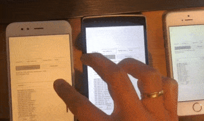
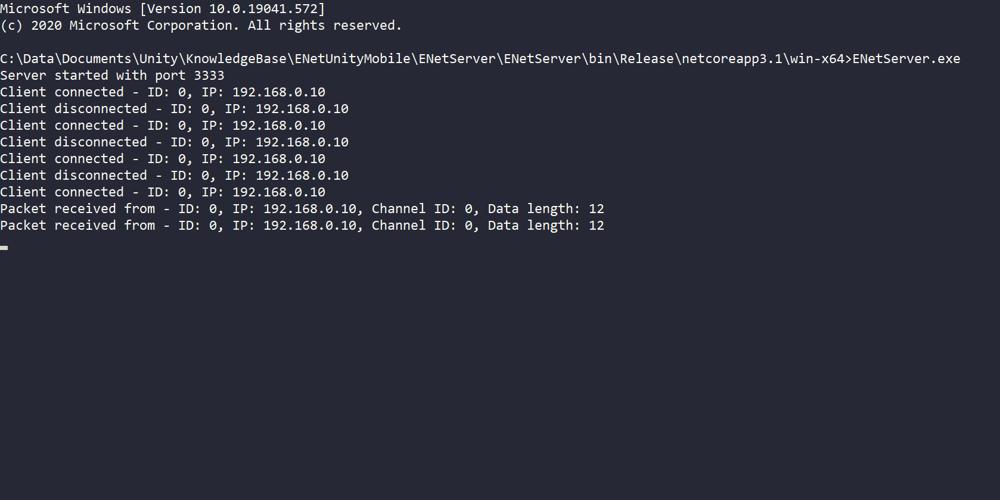
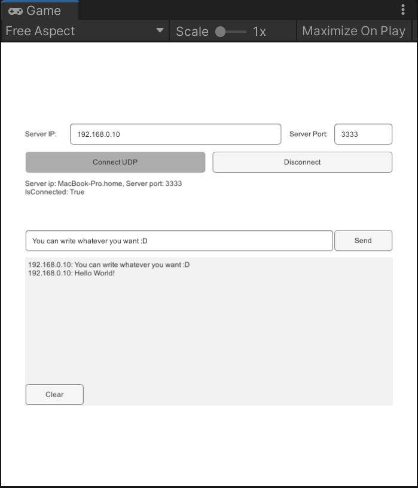
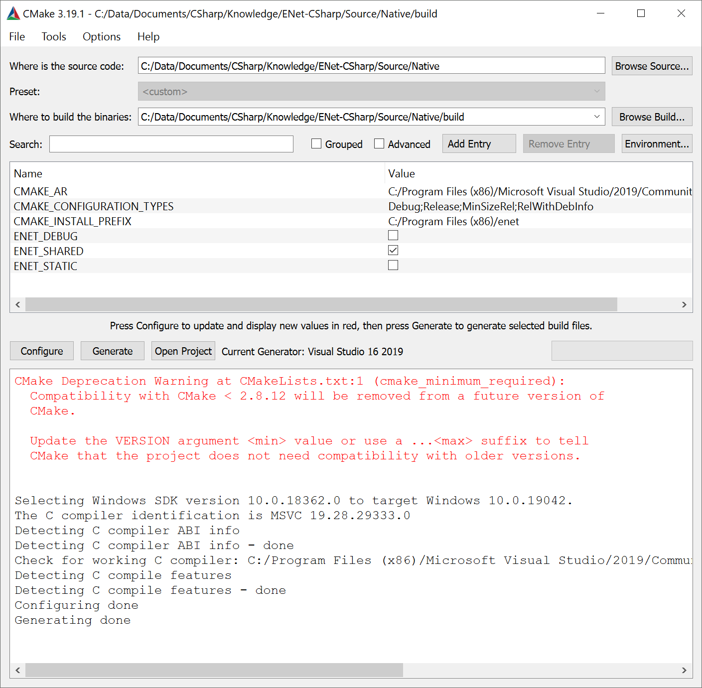

# ENet Unity Mobile Setup

*Bootstrap setup for a client server architecture*  
  

## Description

A multiplayer setup with a unity client and a .Net Core server. The application is a very simple chat server, that shows how the clients can communicate with the server and vice versa. Other than being a small tech demo, the repo explains how to compile ENet for android and iOS and provides built libraries for those platforms to kickstart your project.

| Client platform support | 32 Bit | 64 bit |
| ----------------------- | :----: | :----: |
| Android                 |   ✔️    |   ✔️    |
| iOS                     |   ➖    |   ✔️    |
| Windows                 |   ❌    |   ✔️    |
| Mac                     |   ❌    |   ✔️    |
| Linux                   |   ❌    |   ✔️    |

The server application is built with .Net Core and therefore will run on Windows, Mac or Linux.

### Libraries

* [ENet-CSharp 2.4.6](https://github.com/nxrighthere/ENet-CSharp)
* Unity 2020.2.7f1, but should work fine in almost any version
* .Net 5

## Run Project

### Server

Get the appropriate build from the [release section](../../releases) and run it via command line. Alternatively you can also open the ENetServer Solution with the IDE of your choice and run it.

The server listens to Port 3333 and can be aborted by pressing any key.

### Client

Either get the build for Android or Windows from the [release page](../../releases) or open the project in Unity and run it (Make sure you started the server). Find out the ip of your server (127.0.0.1 if it is on the same machine), and click connect.

When connected successfully, you can enter messages in the box next to the send button. The messages will be broadcasted to all other clients that are online at that time.

## Build Libraries

The easiest way is to get the built libraries from the [release page](../../releases).  
If you want to build them yourself (or for a newer ENet version), take a look at the instructions below.

### Android

1. Download NDK (Or search for the version you use inside unity)
2. Add the build folder inside to your path environment variables e.g `C:/Data/SDKs/android-ndk-r19c/build`
3. Clone `git@github.com:nxrighthere/ENet-CSharp.git`
4. Navigate to `ENet-CSharp/Source/Native`
5. Run `ndk-build` in that location.
6. Copy the folders `arm64-v8a`, `armeabi-v7a` and `x86` from the generated libs folder to your unity project to `Assets/Enet/Plugins/Android/`.
7. Set `arm64-v8a` to ARM64, `armeabi-v7a` to ARMv7 and `x86` to x86.

### iOS

1. Install XCode
2. Clone `git@github.com:nxrighthere/ENet-CSharp.git`
3. Navigate to `ENet-CSharp/Source/Native`
4. Run `sh build-ios.sh`
5. Copy `libenet.a` to your unity project to `Assets/Enet/Plugins/iOS/libenet.a`
6. Set `libenet.a` to iOS only with CPU ARM64

### Windows

1. Install CMake & Visual Studio with C++
2. Navigate to `ENet-CSharp/Source/Native`
3. Create a folder called `build` and open a terminal there
4. run `cmake ..\ -DENET_SHARED=true` - this should fill your build folder with a visual studio project.
   1. Alternatively you can also use the cmake GUI to set up your project.
      
5. Open your sln file and build with MinSizeRel
6. Copy the generated dll from `ENet-CSharp/Source/Native/build/MinSizeRel/enet.dll` to your unity project to `Assets/Enet/Plugins/x86_64`
7. Set `enet.dll` for Editor and Standalone with Windows x64

## License

[MIT](./LICENSE)
